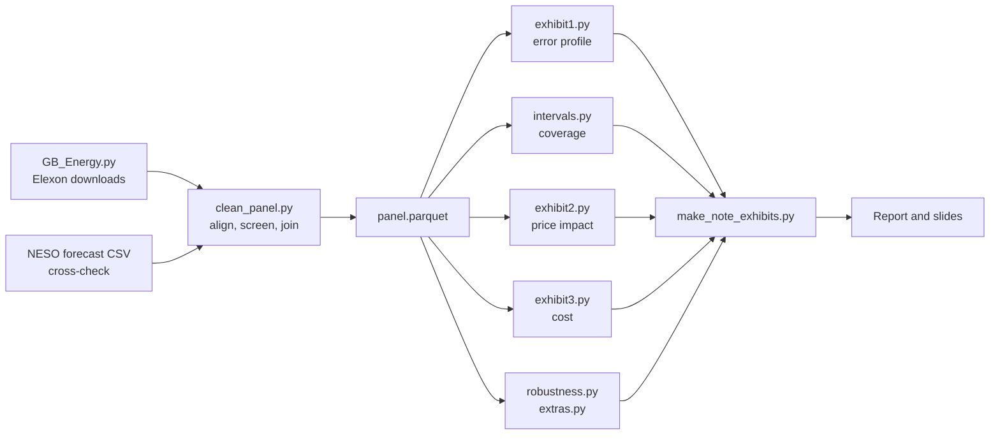

<div align="center">

# 🌬️ Does wind forecast error move GB imbalance prices?

**An out-of-sample test of whether Great Britain wind coming in below its day-ahead forecast pushes the system price above the market price, and what forecast error costs a 1 GW wind portfolio.**


[Findings](#-key-findings) · [Exhibits](#-exhibits) · [Deliverables](#-deliverables) · [Run it](#-run-it) · [Method](#-method) · [Limits](#-limitations) · [Data](#-data-sources)

</div>

---

## 🎯 Key findings

Models are fitted on **2024-25** and tested on **2026 (Jan to Sep)**.

| | Result | What it means |
|---|---|---|
| 📏 **Forecast accuracy** | Mean error **+1.2%** of capacity; MAE 6.1%; RMSE 9.1% | Close to unbiased, and no over-forecasting when wind is high |
| 🎚️ **Prediction intervals** | **84.0%** of 2026 half-hours inside the 80% interval (95%: 94.2%) | Simple quantile intervals hold up; autumn is weak (66%, September only) |
| 💷 **Price impact** | **-£0.33/MWh per GW** of shortfall (95% CI -£1.4 to +£0.6) | No detectable effect; a >2 GW shortfall does not make a +£50 spread more likely (2.4% vs 2.3%) |
| 🧾 **Cost to 1 GW** | **£265k** in Jan-Sep 2026, **0.12%** of revenue | Small on average, driven by the tail: one day (8 Jan 2025) cost £263k |

> **Recommendation:** keep selling the forecast, hold credit for a bad day (about £0.3m per GW), and close the data gaps (gas price, imbalance volume, outages) before any pricing change. Selling less than the forecast shows no robust saving.

These are associations in public data, not causal effects, and the portfolio is hypothetical (it has the national error profile).

## 📊 Exhibits

<table>
<tr>
<td width="50%"><b>1. Forecast error by hour and forecast level</b><br></td>
<td width="50%"><b>2. Price impact: raw vs adjusted</b><br></td>
</tr>
<tr>
<td colspan="2"><b>3. Cost of selling the forecast, and the fragile saving from selling less</b><br></td>
</tr>
</table>

## 📦 Deliverables

| File | What it is |
|---|---|
| [`GB_Wind_Imbalance_2page_Report.docx`](GB_Wind_Imbalance_2page_Report.docx) | 2-page report: findings, recommendations, what would prove us wrong, limits and sources |
| [`GB_Wind_Imbalance_Decision_Slides.pptx`](GB_Wind_Imbalance_Decision_Slides.pptx) | 5 slides for a decision meeting, with speaker notes |

## 🔧 How it works



<details>
<summary><b>Repository layout</b></summary>

```
GB_Energy.py              download Elexon data to data/raw/ (re-runnable)
clean_panel.py            build data/clean/panel.parquet (main) and panel_neso.parquet (cross-check)
exhibit1.py               forecast error profile
intervals.py              prediction intervals and 2026 coverage
exhibit2.py               price impact (day-block bootstrap, HAC)
exhibit3.py               imbalance cost for a 1 GW portfolio
robustness.py             out-of-sample and robustness checks
extras.py                 materiality, concentration, regimes
make_note_exhibits.py     figures for the documents
build_report.js           builds the 2-page Word report
build_deck.js             builds the PowerPoint slides
data/clean/               main panel, result tables, figures used in the documents
```
</details>

## 🚀 Run it

```bash
python3 -m venv .venv && source .venv/bin/activate
pip install -r requirements.txt
python GB_Energy.py            # downloads Elexon data to data/raw/ (skips months already there)
python clean_panel.py          # needs NESO_DayWindForecast.csv in the repo root (see below)
python exhibit1.py main && python intervals.py main && python exhibit2.py main \
  && python exhibit3.py && python robustness.py && python extras.py
python make_note_exhibits.py
```

> **Raw data is not included.** `data/raw/` is created by `GB_Energy.py`. The cross-check track needs the *Day Ahead Wind Forecast (historic)* CSV from the NESO Data Portal, saved as `NESO_DayWindForecast.csv` in the repo root. The main track and all headline results use Elexon data only.

The Word and PowerPoint builders need Node (`npm install docx pptxgenjs`): `node build_report.js` and `node build_deck.js`. `build_deck.js` also references a theme helper, so adjust its path or remove the theme step.

## 🧪 Method

**Conventions** (defined once, used everywhere)

| Term | Definition |
|---|---|
| `error` | actual - forecast |
| `shortfall_gw` | -error / 1000 (positive = wind below forecast) |
| `spread` | system price - MID (Market Index Price) |

**Main track**

- **Forecast:** Elexon WINDFOR (NESO-sourced), the latest vintage published by 09:00 London on the day before delivery, interpolated from hourly to half-hourly.
- **Actual wind:** Elexon AGWS total wind, which includes estimated embedded wind. The BM-metered series (FUELHH) runs about 20% lower and made the forecast look falsely biased.
- **Data screen:** AGWS is faulty from April to November 2024, so 229 days with an AGWS/FUELHH ratio below 0.8 are dropped.
- **Models:** quantile intervals (empirical and quantile regression), OLS with HAC and day-block bootstrap errors, and a newsvendor-style cost comparison.

**Cross-check:** NESO's own forecast file (one vintage per row, many stamped late), usable to 10 December 2025. It gives a different bias (+3.6%) and an unstable slope, so treat it as inconclusive.

## ⚠️ Limitations

No gas price · hypothetical portfolio with the national error profile · no intraday trading or balancing-mechanism actions · rule changes and battery growth not modelled · wind and forecast scope matched by level, not documentation · small 2026 test window (autumn is September only).

## 🗂️ Data sources

| Source | Datasets |
|---|---|
| **Elexon Insights (BMRS)** | WINDFOR, AGWS, FUELHH, system prices, Market Index Data (APXMIDP), initial demand outturn |
| **NESO Data Portal** | Day Ahead Wind Forecast (historic) |

Contains BMRS data (c) Elexon Limited, and NESO data licensed under the NESO Open Data Licence. Raw files are not redistributed here; check each provider's current licence before reusing their data (NESO licenses each dataset individually).

## 👤 Author

**Ram Ridhan** ([@RamRidhan](https://github.com/RamRidhan))

## 📄 Licence

Code and original text: [MIT](LICENSE). Provided for research and discussion; not investment advice. Third-party data remains subject to its providers' terms.
